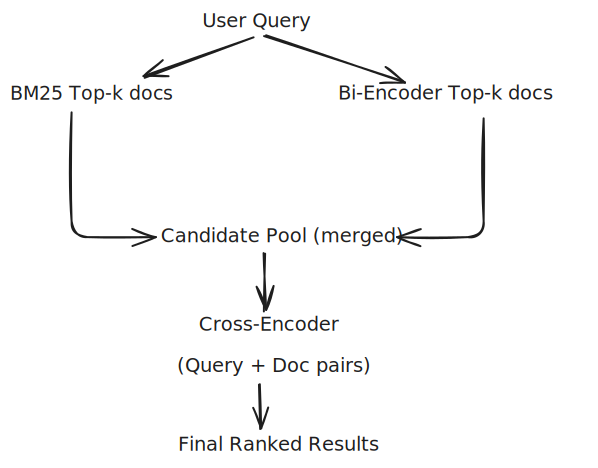

 
---

# Contract Clause Search Chatbot

**BM25 + Bi-Encoder + Cross-Encoder Hybrid Retrieval**

## Overview

This project implements a **contract clause search system** with a chatbot interface using **Gradio**.
It combines three retrieval stages to return highly relevant contract text:

* **BM25 (RankBM25)** — fast keyword-based retrieval
* **Bi-Encoder (all-MiniLM-L6-v2)** — semantic similarity search
* **Cross-Encoder (ms-marco-MiniLM-L-6-v2)** — deep reranking for final accurate results

The chatbot always responds with the top **Cross-Encoder-ranked clause**, giving precise answers to contract-related queries.

---

## How It Works

1. **Load Dataset**
   A CSV file (`contract_clauses_demo.csv`) is loaded and converted into a small Hugging Face `Dataset`.

2. **Tokenization & Preprocessing**
   Uses the Hugging Face tokenizer to clean text and remove stopwords.

3. **BM25 Indexing**
   BM25Okapi provides top lexical matches for each query.

4. **Semantic Retrieval (Bi-Encoder)**
   Encodes both corpus and query, computes cosine similarity, and gets top semantic matches.

5. **Cross-Encoder Reranking**
   BM25 + Bi-Encoder candidates are merged and reranked by the cross-encoder for final results.

6. **Gradio Chatbot UI**

   * Users can type a question or choose preset queries
   * Chatbot returns the top clause
   * Dropdown allows viewing results from BM25 / Bi-Encoder / Cross-Encoder

---

## Running the App

Install dependencies:

```bash
pip install -r requirements.txt
```

Run:

```bash
python app.py
```

Open the Gradio link in the browser.

---
## Demo
[](https://huggingface.co/spaces/xramz/FAQChatbot)


----
## Query Flow

```
User Query  
   → Preprocess  
   → BM25 Retrieve  
   → Bi-Encoder Retrieve  
   → Merge Candidates  
   → Cross-Encoder Rerank  
   → Chatbot Answer (Top Clause)
```
## Retrieval Pipeline Diagram



---

## File Requirements

* `contract_clauses_demo.csv`
  Must have a column named **context** containing clause text.

---

## Features

* Hybrid lexical + semantic retrieval
* Highly accurate reranking
* Interactive Gradio chatbot
* Ability to view intermediate retrieval stage results
* Preset sample queries

---
 


